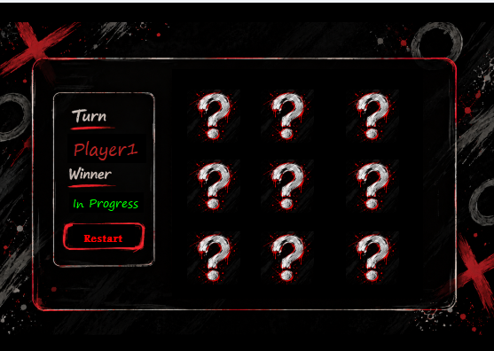

# Tic Tac Toe Game 🎮

A simple Tic Tac Toe game built with C# and Windows Forms as part of my programming learning journey.

## 📸 Preview

## ✨ Features

- Two-player gameplay (X and O).
- Turn indicator to show the current player.
- Winner detection for rows, columns, and diagonals.
- Draw detection.
- Prevents players from selecting an already occupied cell.
- Restart button to start a new game.

## 🛠️ Technologies Used

- C#
- Windows Forms
- .NET Framework
- Visual Studio

## 🚀 Getting Started

1. Clone this repository.
2. Open the solution in Visual Studio.
3. Build and run the project.
4. Enjoy playing Tic Tac Toe!

## 🎯 What I Learned

- Handling events in Windows Forms.
- Working with controls such as `PictureBox`, `Label`, and `Button`.
- Using the `Tag` property to store control state.
- Working with two-dimensional arrays.
- Implementing game logic and winner detection.
- Organizing code into methods.

## 👨‍💻 About

This project is part of my journey to improve my C# and software development skills through practical projects.

